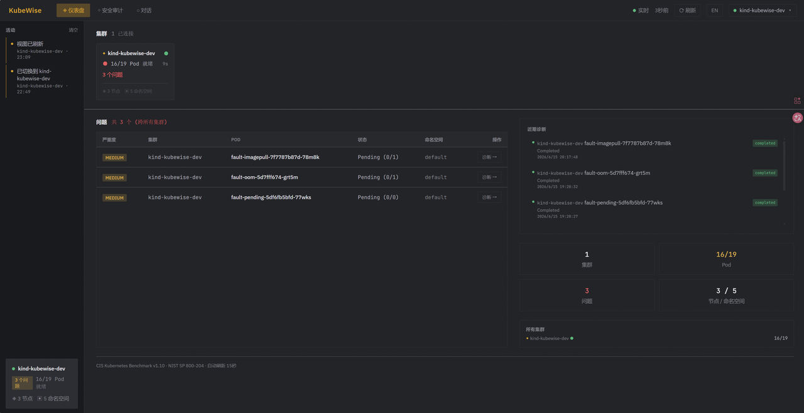
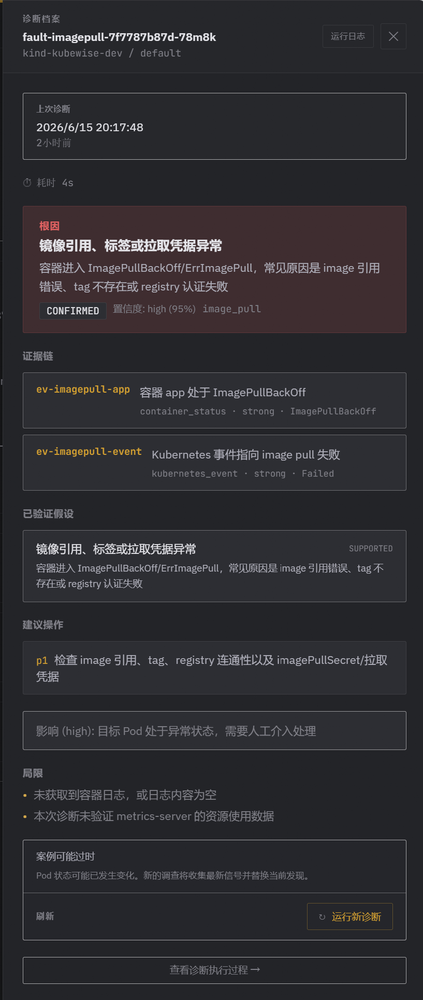

# KubeWise

面向 Kubernetes 的 AI 运维工作台。KubeWise 把多集群概览、Pod 诊断、安全审计、自然语言问答和受控操作统一到一个可追踪、可解释、可确认的系统里，帮助 SRE 和平台工程师更快理解集群正在发生什么。

[](https://go.dev)
[](https://kubernetes.io)
[](frontend)
[](LICENSE)

Kubernetes 排障最消耗人的地方在于上下文分散：Pod 状态、事件、上一轮容器日志、资源限制、Deployment、Service Endpoints、节点状态和多集群 context 都在不同位置。KubeWise 会把这些信息组织成一条清晰的诊断链：先采集证据，再形成假设，最后给出可以审查的根因判断和修复建议。

<p align="center">
  
</p>

<p align="center">
  <sub>多集群概览、异常 Pod 分诊、最近诊断和集群健康指标集中在同一个工作台中。</sub>
</p>

## 特性

| 能力 | 说明 |
|---|---|
| 多集群工作台 | 从 kubeconfig 读取多个 context，展示集群健康状态、Pod 就绪数、问题数、节点数和命名空间数 |
| 异常 Pod 分诊 | 聚合非 Running/Succeeded Pod，按严重程度展示问题，支持从问题列表直接发起诊断 |
| 证据链式诊断 | 异步执行 Pod 诊断，实时输出阶段进度、工具调用、证据、候选假设和结构化报告 |
| 安全审计 | 覆盖 RBAC、Pod Security、NetworkPolicy、镜像配置四类风险检查，支持报告导出 |
| 自然语言 Agent | 支持查询、排障、安全、操作、部署等意图路由，通过工具调用完成多步任务 |
| 人机协同操作 | 扩缩容、重启、删除、apply、部署等写操作进入确认流程，由用户审查后执行 |
| 多入口使用 | 提供 Web 控制台、CLI、TUI 和 HTTP API，适合日常巡检、终端排障和平台集成 |
| 状态持久化 | 会话、诊断、审计和活动记录持久化，方便回看一次排障过程的上下文 |

## 快速开始

### 使用 Docker Compose

适合快速启动完整的 Web 控制台和后端服务。

```bash
git clone https://github.com/kubewise/kubewise.git
cd kubewise

export KUBEWISE_LLM_API_KEY="your-api-key"
export KUBEWISE_LLM_MODEL="glm-5.1"
export KUBEWISE_LLM_API_BASE="https://open.bigmodel.cn/api/paas/v4/"

docker compose up --build
```

启动后访问：

| 服务 | 地址 |
|---|---|
| Web 控制台 | `http://localhost:3000` |
| 后端健康检查 | `http://localhost:8080/health` |

Docker Compose 会把本机 `${HOME}/.kube/config` 以只读方式挂载到后端容器，并把 KubeWise 数据持久化到 Docker volume。

### 本地开发运行

适合调试后端、前端或 Agent 行为。

```bash
git clone https://github.com/kubewise/kubewise.git
cd kubewise

cp examples/config.yaml ~/.kubewise.yaml
```

编辑 `~/.kubewise.yaml`，填入你的 kubeconfig 和兼容 OpenAI API 的模型服务：

```yaml
kubeconfig: "~/.kube/config"
data_dir: "~/.kubewise"

llm:
  model: "glm-5.1"
  api_key: "your-api-key"
  api_base: "https://open.bigmodel.cn/api/paas/v4/"
```

启动后端：

```bash
go build -o kubewise ./cmd
./kubewise serve --addr :8080
```

启动前端：

```bash
cd frontend
npm install
VITE_PROXY_TARGET=http://localhost:8080 npm run dev
```

前端默认监听 Vite 端口，通常是 `http://localhost:5173`。

## 使用方式

KubeWise 提供多种入口，覆盖从日常巡检到平台集成的不同场景：

| 入口 | 适合场景 | 示例 |
|---|---|---|
| Web 控制台 | 多集群看板、问题列表、诊断报告、安全审计 | `docker compose up` |
| CLI | 快速问一句集群状态或执行一次任务 | `kubewise chat "检查 default 命名空间异常 Pod"` |
| TUI | 终端内连续排障、查看流式过程、确认操作 | `kubewise tui` |
| HTTP API | 集成到自己的平台、脚本或自动化系统 | `kubewise serve --addr :8080` |

CLI 单次查询：

```bash
kubewise chat "列出所有 namespace"
kubewise chat "检查 default 命名空间有没有 CrashLoopBackOff 的 Pod"
kubewise chat "扫描当前集群的安全风险"
```

TUI 多轮会话：

```bash
kubewise tui
```

HTTP API：

```bash
kubewise serve --addr :8080
curl http://localhost:8080/api/v1/clusters
```

REST + SSE 接口说明见：

- [OpenAPI 描述](docs/openapi.yaml)
- [API 文档](docs/KubeWise%20API.md)

## 诊断流程

KubeWise 的诊断围绕 Kubernetes 证据逐步收敛：

<p align="center">
  
</p>

<p align="center">
  <sub>诊断报告会展示根因、证据链、已验证假设、建议操作、影响范围和局限说明。</sub>
</p>

```text
Pod 目标
  ↓
基础采集：Pod 状态、事件、容器日志
  ↓
补充观测：按需读取资源用量、Pod 详情、相关对象等信息
  ↓
证据构建：把原始观测整理成证据清单
  ↓
候选根因：生成多个可验证的故障假设
  ↓
假设验证：用工具结果和证据验证或反驳候选根因
  ↓
结构化报告：根因、证据链、影响范围、修复建议、限制说明
```

诊断任务通过后端异步执行，前端可通过 SSE 实时展示阶段进度、工具调用、证据数量和最终报告。报告保留推理依据，方便用户判断建议是否可信。

## 安全模型

KubeWise 的设计原则是：AI 给出判断和建议，用户保留最终控制权。

- 默认使用当前 kubeconfig 权限，不绕过 Kubernetes RBAC。
- 查询、诊断和审计以只读工具为主。
- 写操作需要进入确认流程，执行前展示计划和关键参数。
- 部署流程会展示 Chart 选择、values 配置和执行确认。
- 诊断报告保留证据与限制说明，帮助用户审查模型结论。

## 架构概览

```text
Web / TUI / CLI / HTTP API
          │
          ▼
   Conversation / Diagnosis / Audit / Observability Services
          │
          ▼
      Agent Runtime
          │
          ├── Router Agent：意图分类与实体提取
          ├── Query Agent：多工具 ReAct 查询
          ├── Diagnosis Agent：证据链式 Pod 诊断
          ├── Audit Agent：四类安全审计
          ├── Operation Agent：计划、确认、执行
          └── Deploy Agent：Helm 应用部署流水线
          │
          ▼
  Tool Registry / Kubernetes Client / Helm / SQLite
          │
          ▼
      Kubernetes Clusters
```

## HTTP API

当前后端暴露以下主要接口：

| 模块 | 接口能力 |
|---|---|
| Chat | 同步问答、SSE 流式问答、人机协同回答 |
| Sessions | 会话列表、创建、详情、删除 |
| Clusters | 集群列表、集群问题、Kubernetes Events |
| Diagnoses | 创建诊断、列表、最新诊断、详情、取消、SSE 事件流 |
| Audits | 创建审计、列表、最新审计、详情、取消、SSE 事件流 |
| Activities | 活动流列表 |

## 技术栈

| 层 | 选型 |
|---|---|
| 后端 | Go 1.26, Echo, Cobra, zap |
| Kubernetes | client-go v0.36, Dynamic Client |
| Agent / LLM | openai-go v3，兼容 GLM、Qwen、DeepSeek 等 OpenAI API 风格服务 |
| TUI | Bubble Tea, Bubbles, Lip Gloss |
| 前端 | React 18, TypeScript, Vite, Tailwind CSS |
| 持久化 | SQLite, JSON 会话文件 |
| 部署 | Docker, Docker Compose, Nginx 反向代理 |

## 开发与验证

主项目测试：

```bash
GOCACHE=/tmp/kubewise-go-cache go test ./internal/... ./cmd
```

前端构建：

```bash
cd frontend
npm run build
```

本地多集群故障实验可以参考 [experiments/README.md](experiments/README.md)。

## 路线图

KubeWise 的核心链路已经覆盖从集群观察、问题发现、证据采集、诊断报告到受控操作的完整流程。接下来会继续沿着以下方向增强：

- 提升 Pod 诊断在更多真实故障场景下的稳定性和解释质量；
- 增加 Kubernetes 只读观测工具，扩展跨资源关联分析能力；
- 完善安全审计规则、风险分级和修复建议；
- 优化 Web/TUI 中诊断过程、证据链和报告的阅读体验；
- 改进部署、配置、API 文档和二次集成体验；
- 为常见故障场景补充可复现的本地实验。

## 贡献

欢迎提交 Issue 和 Pull Request。为了让讨论更高效，建议在提交前说明：

- 你遇到的 Kubernetes 场景或用户问题；
- 期望 KubeWise 给出的行为；
- 你采用的验证方式；
- 改动涉及的入口，例如 Web、TUI、CLI、API 或 Agent Runtime。

KubeWise 适合小步、可验证的改进：一个更可靠的工具、一个更清晰的报告字段、一个更准确的诊断阶段，都能让它在真实排障中更有用。

## 许可证

[Apache License 2.0](LICENSE)
