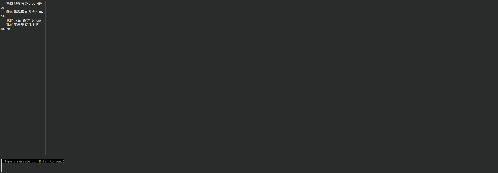

# KubeWise

> AI 驱动的 Kubernetes 运维工作台 —— 让集群排障有据可查、有链可追、有人可审。

[](https://go.dev)
[](https://kubernetes.io)
[](frontend)
[](LICENSE)

KubeWise 把多集群概览、Pod 诊断、安全审计、自然语言问答和受控操作统一到一个可追踪、可解释、可确认的系统里，帮助 SRE 和平台工程师更快理解集群正在发生什么。

<p align="center">
  
</p>

<p align="center">
  <sub>多集群概览、异常 Pod 分诊、最近诊断和集群健康指标集中在同一个工作台中。</sub>
</p>

---

## 目录

- [核心特性](#核心特性)
- [快速开始](#快速开始)
  - [Docker Compose 一键启动](#docker-compose-一键启动)
  - [本地开发运行](#本地开发运行)
  - [搭建开发用 Kind 集群](#搭建开发用-kind-集群)
- [使用方式](#使用方式)
  - [Web 控制台](#web-控制台)
  - [CLI 单次查询](#cli-单次查询)
  - [TUI 终端交互](#tui-终端交互)
  - [HTTP API](#http-api)
- [诊断流程](#诊断流程)
- [安全模型](#安全模型)
- [架构概览](#架构概览)
- [配置说明](#配置说明)
- [技术栈](#技术栈)
- [项目结构](#项目结构)
- [开发与测试](#开发与测试)
- [操作指南](#操作指南)
- [路线图](#路线图)
- [贡献](#贡献)
- [许可证](#许可证)

---

## 核心特性

| 能力 | 说明 |
|---|---|
| **多集群工作台** | 从 kubeconfig 读取多个 context，展示集群健康状态、Pod 就绪数、问题数、节点数和命名空间数 |
| **异常 Pod 分诊** | 聚合非 Running/Succeeded Pod，按严重程度展示，支持从问题列表直接发起诊断 |
| **证据链式诊断** | 异步执行 Pod 诊断，实时输出阶段进度、工具调用、证据、候选假设和结构化报告 |
| **安全审计** | 覆盖 RBAC、Pod Security、NetworkPolicy、镜像配置四类风险检查，支持报告导出 |
| **自然语言 Agent** | 支持查询、排障、安全、操作、部署等意图路由，通过工具调用完成多步任务 |
| **Helm 应用部署** | 集成 Artifact Hub 搜索、Chart 目录、values 生成、预检、计划审查和执行确认 |
| **人机协同操作** | 扩缩容、重启、删除、apply、部署等写操作进入确认流程，由用户审查后执行 |
| **Supervisor 监管** | 自动检测 Agent 循环调用（重复、乒乓、同工具），评估后继续、重置或终止 |
| **多入口使用** | 提供 Web 控制台、CLI、TUI 和 HTTP API，覆盖日常巡检、终端排障和平台集成 |
| **状态持久化** | 会话、诊断、审计和活动记录持久化到 SQLite 和 JSON 文件，方便回看排障上下文 |

---

## 快速开始

在开始之前，请确保你的 `${HOME}/.kube/config` 文件存在并记录了有效的 K8s 容器登录信息。如果是本机部署的容器，请务必将 `host.docker.internal:host-gateway` 域名加入证书中。

如果你还没有一个正常运行的容器，请参考我们的 [Kind 开发启动指南](docs/how-to-dev.md)

### Docker Compose 一键启动

适合快速体验完整的 Web 控制台和后端服务。

```bash
git clone https://github.com/kubewise/kubewise.git
cd kubewise

# 设置 LLM 服务（必填）
export KUBEWISE_LLM_API_KEY="your-api-key"
export KUBEWISE_LLM_MODEL="glm-5.1"
export KUBEWISE_LLM_API_BASE="https://open.bigmodel.cn/api/paas/v4/"

# 启动服务
docker compose up --build
```

启动后访问：

| 服务 | 地址 | 说明 |
|---|---|---|
| Web 控制台 | `http://localhost:3000` | 前端 SPA，通过 Nginx 反向代理连接后端 |
| 后端健康检查 | `http://localhost:8080/health` | 验证后端是否正常运行 |

> **说明**：Docker Compose 会把本机 `${HOME}/.kube/config` 以只读方式挂载到后端容器，并把 KubeWise 数据持久化到名为 `kubewise-data` 的 Docker volume。

支持的 LLM 服务（兼容 OpenAI API）：

| 模型 | `KUBEWISE_LLM_MODEL` | `KUBEWISE_LLM_API_BASE` |
|---|---|---|
| 智谱 GLM | `glm-5.1` | `https://open.bigmodel.cn/api/paas/v4/` |
| 通义千问 | `qwen3` | `https://dashscope.aliyuncs.com/compatible-mode/v1` |
| DeepSeek | `deepseek-chat` | `https://api.deepseek.com/v1` |
| OpenAI | `gpt-4o` | `https://api.openai.com/v1` |

### 本地开发运行

适合调试后端、前端或 Agent 行为。

**1. 复制配置文件**

```bash
cp examples/config.yaml ~/.kubewise.yaml
```

**2. 编辑 `~/.kubewise.yaml`**

```yaml
kubeconfig: "~/.kube/config"       # kubeconfig 路径
data_dir: "~/.kubewise"            # 数据存储目录

llm:
  model: "glm-5.1"                 # 模型名称
  api_key: "your-api-key"          # API Key
  api_base: "https://open.bigmodel.cn/api/paas/v4/"  # API 地址
```

> 完整配置项说明见 [配置说明](#配置说明) 章节。

**3. 启动后端**

```bash
go build -o kubewise ./cmd
./kubewise serve --addr :8080
```

**4. 启动前端（另开终端）**

```bash
cd frontend
npm install
VITE_PROXY_TARGET=http://localhost:8080 npm run dev
```

前端默认运行在 `http://localhost:5173`。

### 搭建开发用 Kind 集群

如果没有现成的 Kubernetes 集群，可以用 Kind 快速搭建本地开发环境。详细步骤见 [docs/how-to-dev.md](docs/how-to-dev.md)。

```bash
# 安装 kind
go install sigs.k8s.io/kind@v0.31.0

# 创建集群（使用项目提供的配置）
mkdir -p .kube
kind create cluster --config ./.kube/kind-kubewise.yaml

# 导出 kubeconfig
kind export kubeconfig --name kubewise-dev --kubeconfig ./.kube/config

# 设置环境变量
export KUBECONFIG=./.kube/config

# 安装 metrics-server（Kind 默认不带）
kubectl apply -f https://cdn.gh-proxy.org/https://github.com/kubernetes-sigs/metrics-server/releases/latest/download/components.yaml
```

---

## 使用方式

KubeWise 提供四种入口，覆盖从日常巡检到平台集成的不同场景：

| 入口 | 适合场景 | 启动方式 |
|---|---|---|
| **Web 控制台** | 多集群看板、问题列表、诊断报告、安全审计、Helm 部署 | `docker compose up` 或 `kubewise serve` |
| **CLI** | 快速问一句集群状态或执行一次任务 | `kubewise chat "..."` |
| **TUI** | 终端内连续排障、查看流式过程、确认操作 | `kubewise tui` |
| **HTTP API** | 集成到自己的平台、脚本或自动化系统 | `kubewise serve --addr :8080` |

### Web 控制台

<p align="center">
  
</p>

Web 控制台包含三个主要标签页：

- **Dashboard（仪表盘）**：多集群概览、异常 Pod 列表、集群健康指标
- **Audit（安全审计）**：四类安全风险扫描，支持查看详细报告
- **Chat（智能对话）**：自然语言交互，支持查询、排障、操作和部署

异常 Pod 支持直接点击「诊断」按钮，启动证据链式诊断流程。

### CLI 单次查询

```bash
# 查询集群信息
kubewise chat "列出所有 namespace"

# 排查异常 Pod
kubewise chat "检查 default 命名空间有没有 CrashLoopBackOff 的 Pod"

# 安全扫描
kubewise chat "扫描当前集群的安全风险"

# 执行操作
kubewise chat "把 nginx deployment 扩容到 3 个副本"
```

### TUI 终端交互

```bash
kubewise tui
```

<p align="center">
  
</p>

<p align="center">
  <sub>TUI 支持多轮对话、实时流式输出和操作确认。</sub>
</p>

TUI 提供完整的终端交互体验：

- 多轮对话，上下文自动保持
- 实时展示 Agent 工具调用和推理过程
- 写操作前弹出确认对话框
- 侧边栏显示会话列表

### HTTP API

```bash
# 启动 API 服务
kubewise serve --addr :8080

# 查询集群列表
curl http://localhost:8080/api/v1/clusters

# 创建诊断
curl -X POST http://localhost:8080/api/v1/diagnoses \
  -H "Content-Type: application/json" \
  -d '{"cluster": "my-cluster", "namespace": "default", "pod_name": "my-pod"}'

# SSE 流式对话
curl -N http://localhost:8080/api/v1/chat/stream \
  -H "Content-Type: application/json" \
  -d '{"message": "列出所有 namespace", "session_id": ""}'
```

完整的 REST + SSE 接口文档：

- [OpenAPI 描述](docs/openapi.yaml) — 标准 OpenAPI 3.1 规范
- [API 文档](docs/KubeWise%20API.md) — 详细的接口说明和示例
- [API 概览](docs/api.md) — 快速参考

---

## 诊断流程

KubeWise 的诊断围绕 Kubernetes 证据逐步收敛，形成可审查的根因判断：

<p align="center">
  
</p>

<p align="center">
  <sub>诊断报告会展示根因、证据链、已验证假设、建议操作、影响范围和局限说明。</sub>
</p>

```text
Pod 目标
  ↓
基础采集：Pod 状态、事件、容器日志
  ↓
补充观测：按需读取资源用量、Pod 详情、相关对象等信息
  ↓
证据构建：把原始观测整理成证据清单
  ↓
候选根因：生成多个可验证的故障假设
  ↓
假设验证：用工具结果和证据验证或反驳候选根因
  ↓
结构化报告：根因、证据链、影响范围、修复建议、限制说明
```

诊断任务通过后端异步执行，前端可通过 SSE 实时展示：

- 阶段进度（采集 → 观测 → 证据 → 假设 → 验证 → 报告）
- 工具调用详情和返回结果
- 证据数量和假设列表
- 最终结构化报告

报告保留完整推理依据，方便用户判断建议是否可信。

---

## 安全模型

KubeWise 的设计原则是：**AI 给出判断和建议，用户保留最终控制权。**

- **权限继承**：默认使用当前 kubeconfig 权限，不绕过 Kubernetes RBAC
- **只读优先**：查询、诊断和审计以只读工具为主
- **写操作确认**：扩缩容、重启、删除等写操作需要用户在确认流程中审查计划和关键参数后才执行
- **部署审批**：Helm 部署流程会展示 Chart 选择、values 配置和执行确认
- **透明报告**：诊断报告保留证据与限制说明，帮助用户审查模型结论

---

## 架构概览

```text
┌─────────────────────────────────────────────────────────┐
│            Web Console / TUI / CLI / HTTP API            │
└──────────────────────────┬──────────────────────────────┘
                           │
┌──────────────────────────▼──────────────────────────────┐
│          Conversation / Diagnosis / Audit /              │
│          Observability / Activity Feed Services           │
└──────────────────────────┬──────────────────────────────┘
                           │
┌──────────────────────────▼──────────────────────────────┐
│                     Agent Runtime                        │
│  ┌─────────────┐  ┌──────────────┐  ┌────────────────┐  │
│  │ Router Agent │  │  Sub-Agents  │  │   Supervisor   │  │
│  │  意图分类    │  │              │  │   循环检测     │  │
│  │  实体提取    │  │  ├─ Query    │  │   自动干预     │  │
│  └──────┬──────┘  │  ├─ Troubles │  └────────────────┘  │
│         │         │  ├─ Security │                       │
│         └────────▶│  ├─ Operation│  ┌────────────────┐  │
│                   │  ├─ Deploy   │  │  Diagnose Agent│  │
│                   │  └─ Diagnose │  │  证据链式诊断  │  │
│                   └──────────────┘  └────────────────┘  │
└──────────────────────────┬──────────────────────────────┘
                           │
┌──────────────────────────▼──────────────────────────────┐
│          Tool Registry / K8s Client / Helm / SQLite      │
└──────────────────────────┬──────────────────────────────┘
                           │
                  ┌────────▼────────┐
                  │   Kubernetes    │
                  │    Clusters     │
                  └─────────────────┘
```

**Agent 意图路由**：用户输入经过 Router Agent 分类为五种意图（查询、排障、安全、操作、部署），分发给对应的子 Agent 执行。每个子 Agent 使用 ReAct 工具调用循环完成任务，Supervisor 负责监控循环健康。

---

## 配置说明

KubeWise 通过 `~/.kubewise.yaml` 配置文件或环境变量进行配置。配置优先级：**命令行参数 > 环境变量 > 配置文件 > 默认值**。

<details>
<summary>完整配置示例（点击展开）</summary>

```yaml
# Kubernetes 配置文件路径（默认 ~/.kube/config）
kubeconfig: "~/.kube/config"

# 数据存储目录（默认 ~/.kubewise）
data_dir: "~/.kubewise"

# LLM 配置
llm:
  model: "glm-5.1"                                    # 模型名称
  api_key: "your-api-key"                              # API Key（或设置 KUBEWISE_LLM_API_KEY）
  api_base: "https://open.bigmodel.cn/api/paas/v4/"   # API Base URL

# 日志配置（需配合 -v 参数启用）
log:
  level: "info"        # debug / info / warn / error
  file: "stderr"       # 日志文件路径，stderr/stdout 为控制台输出

# Agent 配置
agent:
  max_steps: 20        # 最大工具调用轮次（或 KUBEWISE_AGENT_MAX_STEPS / --max-steps）
  supervisor:
    enabled: true                   # 是否启用 Supervisor
    repeat_threshold: 3             # 相同工具+参数连续调用 N 次后触发检测
    ping_pong_threshold: 3          # A-B-A-B 交替调用 N 次后触发检测
    same_tool_threshold: 5          # 同一工具名连续调用 N 次后触发检测
    max_extensions: 2               # 最大继续授权次数
    extension_step_grant: 10        # 每次继续授权额外给多少步
    max_evaluator_calls: 2          # 最大 LLM 评估调用次数

# Deploy Agent 配置
deploy:
  artifact_hub:
    enabled: true       # 是否启用 Artifact Hub 在线搜索
    timeout: 5s         # 搜索超时
    selection_timeout: 10s  # 用户选择 Chart 超时
  helm:
    wait_timeout: 5m    # helm install/upgrade 等待超时

# HTTP API 配置
api:
  addr: ":8080"         # 监听地址
```

</details>

**环境变量对照表**：

| 环境变量 | 配置项 | 说明 |
|---|---|---|
| `KUBEWISE_LLM_API_KEY` | `llm.api_key` | LLM API Key |
| `KUBEWISE_LLM_MODEL` | `llm.model` | 模型名称 |
| `KUBEWISE_LLM_API_BASE` | `llm.api_base` | API Base URL |
| `KUBEWISE_LOG_LEVEL` | `log.level` | 日志级别 |
| `KUBEWISE_AGENT_MAX_STEPS` | `agent.max_steps` | 最大工具调用轮次 |

---

## 技术栈

| 层 | 选型 |
|---|---|
| **后端语言** | Go 1.26 |
| **HTTP 框架** | Echo v5 |
| **CLI 框架** | Cobra + pflag |
| **日志** | zap (uber) |
| **Kubernetes 客户端** | client-go v0.36, Dynamic Client |
| **Agent / LLM** | openai-go v3，兼容 GLM、Qwen、DeepSeek 等 OpenAI API 风格服务 |
| **TUI** | Bubble Tea, Bubbles, Lip Gloss (Charm) |
| **前端** | React 18, TypeScript, Vite 6, Tailwind CSS 3 |
| **前端国际化** | i18next + react-i18next |
| **持久化** | SQLite (WAL 模式), JSON 会话文件 |
| **Helm 集成** | Helm v4 |
| **容器化** | Docker, Docker Compose, Nginx 反向代理 |

---

## 项目结构

```text
kubewise/
├── cmd/                          # CLI 入口（Cobra）
│   └── main.go                   # chat / tui / serve 子命令
├── internal/                     # 后端 Go 代码（Clean Architecture / DDD）
│   ├── activityfeed/             # 活动流
│   ├── audit/                    # 安全审计
│   ├── config/                   # 配置加载
│   ├── conversation/             # 对话与会话管理
│   ├── diagnosis/                # Pod 诊断
│   ├── observability/            # 集群概览与问题发现
│   ├── platform/                 # 核心平台服务
│   │   ├── agentruntime/         # Agent 运行时
│   │   │   ├── router/           # 意图分类路由
│   │   │   ├── subagent/         # 子 Agent（query/troubleshoot/security/operation/deploy）
│   │   │   ├── diagnose/         # 证据链式诊断引擎
│   │   │   ├── audit/            # 审计解析与报告
│   │   │   ├── loop/             # ReAct 循环执行器
│   │   │   ├── supervisor/       # 循环检测与自动干预
│   │   │   ├── tool/             # 工具注册表（query/troubleshoot/security/operation）
│   │   │   └── event/            # 事件发射（SSE/TUI）
│   │   ├── cluster/              # 多集群 K8s 客户端管理
│   │   └── persistence/          # SQLite 数据库与迁移
│   ├── transport/                # HTTP 传输层
│   ├── tui/                      # 终端 UI（Bubble Tea）
│   └── utils/                    # 工具库（Helm/LLM/日志）
├── frontend/                     # React SPA
│   ├── src/
│   │   ├── components/           # UI 组件（Dashboard/Chat/SecurityAudit/Diagnosis）
│   │   ├── api/                  # API 客户端与 SSE 工具
│   │   ├── stores/               # 客户端状态管理
│   │   └── i18n/                 # 国际化资源
│   ├── Dockerfile                # Bun 构建 + Nginx 运行时
│   └── nginx.conf                # 反向代理配置
├── docs/                         # 文档
│   ├── KubeWise API.md           # 详细 API 文档
│   ├── openapi.yaml              # OpenAPI 3.1 规范
│   ├── how-to-dev.md             # 开发环境搭建
│   └── assets/                   # 截图与资源
├── examples/                     # 配置示例
│   └── config.yaml
├── experiments/                  # 多集群故障注入实验
├── Dockerfile                    # 后端多阶段构建
├── docker-compose.yml            # 完整服务编排
└── go.mod / go.sum
```

---

## 开发与测试

**运行后端测试**：

```bash
GOCACHE=/tmp/kubewise-go-cache go test ./internal/... ./cmd
```

**前端构建验证**：

```bash
cd frontend
npm run build
```

**多集群故障实验**：

项目提供了一套多集群故障注入脚本，可以快速创建带有预设故障的 Kind 集群，用于测试 Dashboard 和诊断功能。详见 [experiments/README.md](experiments/README.md)。

支持的故障类型：

- `CrashLoopBackOff` — 应用启动失败反复重启
- `OOMKilled` — 内存溢出被杀
- `ImagePullBackOff` — 镜像拉取失败
- `Pending` — Pod 无法调度

---

## 操作指南

详细的使用操作指南请参见 [docs/操作指南.md](docs/操作指南.md)，内容包括：

- Web 控制台各功能模块的操作说明
- 自然语言对话的常用提问示例
- Pod 诊断的完整操作流程
- 安全审计的使用方法
- Helm 应用部署的步骤
- TUI 和 CLI 的进阶用法
- 常见问题排查

---

## 路线图

KubeWise 的核心链路已经覆盖从集群观察、问题发现、证据采集、诊断报告到受控操作的完整流程。接下来会继续沿着以下方向增强：

- 提升 Pod 诊断在更多真实故障场景下的稳定性和解释质量
- 增加 Kubernetes 只读观测工具，扩展跨资源关联分析能力
- 完善安全审计规则、风险分级和修复建议
- 优化 Web/TUI 中诊断过程、证据链和报告的阅读体验
- 改进部署、配置、API 文档和二次集成体验
- 为常见故障场景补充可复现的本地实验

---

## 贡献

欢迎提交 Issue 和 Pull Request。为了让讨论更高效，建议在提交前说明：

- 你遇到的 Kubernetes 场景或用户问题
- 期望 KubeWise 给出的行为
- 你采用的验证方式
- 改动涉及的入口，例如 Web、TUI、CLI、API 或 Agent Runtime

KubeWise 适合小步、可验证的改进：一个更可靠的工具、一个更清晰的报告字段、一个更准确的诊断阶段，都能让它在真实排障中更有用。

---

## 许可证

[Apache License 2.0](LICENSE)
