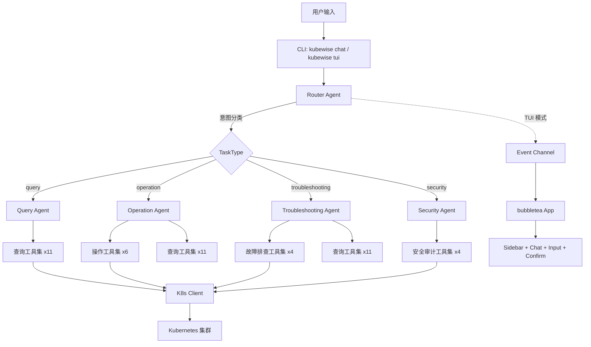

# KubeWise 项目状态报告与快速上手指南

> 生成时间: 2026-05-05 | 基于 main 分支最新提交 d86280c (2026-05-01)

---

## 一、项目概览

KubeWise 是一个面向 Kubernetes 集群的智能自动运维 Agent 系统，将 LLM 的自然语言理解能力与 Kubernetes API 深度融合。用户可以通过自然语言完成集群查询、资源操作、故障排查和安全审计。

### 技术栈

| 组件 | 技术选型 |
|------|---------|
| 语言 | Go 1.26 |
| CLI 框架 | Cobra + Viper |
| K8s 客户端 | client-go v0.36 + dynamic client |
| LLM 客户端 | openai-go v3 SDK（兼容所有 OpenAI API 格式） |
| TUI 框架 | bubbletea + lipgloss + bubbles |
| 语法高亮 | chroma/v2 |
| 工具协议 | 自研动态注册中心（兼容 MCP 概念） |

---

## 二、架构总览



---

## 三、功能完成度

### 3.1 四大 Agent — 全部已完成 ✅

| Agent | 文件 | 状态 | 核心能力 |
|-------|------|------|---------|
| Router Agent | `pkg/agent/router/agent.go` | ✅ 完成 | LLM 意图分类 + 实体提取 + 路由分发 + HandleQueryStream |
| Query Agent | `pkg/agent/query/agent.go` | ✅ 完成 | ReAct 循环，最多 10 轮工具调用，自动纠错 |
| Operation Agent | `pkg/agent/operation/agent.go` | ✅ 完成 | LLM 规划 → 用户确认 → 执行，支持修正重规划 |
| Troubleshooting Agent | `pkg/agent/troubleshooting/agent.go` | ✅ 完成 | 系统性信息收集 → 根因分析 → 修复建议 |
| Security Agent | `pkg/agent/security/agent.go` | ✅ 完成 | RBAC/Pod安全/网络策略/镜像安全四维审计 |

### 3.2 工具集 — 全部已完成 ✅

**查询工具 (11个, `pkg/tools/v1/query/`):**
- `list_persistent_volumes` / `list_persistent_volume_claims`
- `find_pods_using_pvc` / `list_pods_in_namespace`
- `get_pod_resource_usage` / `list_namespaces`
- `list_configmaps_in_namespace` / `get_configmap_content`
- `list_custom_resources_by_gvr` / `get_custom_resource_by_gvr_and_name`
- `list_resources_by_gvr`

**操作工具 (6个, `pkg/tools/v1/operation/`):**
- `scale.go` — 调整 Deployment/StatefulSet 副本数
- `restart.go` — 触发滚动重启
- `delete.go` — 通过 GVR 删除任意资源
- `apply.go` — Server-Side Apply YAML
- `cordon_drain.go` — 节点封锁/解封/驱逐
- `label_annotate.go` — 修改标签/注解

**故障排查工具 (4个, `pkg/tools/v1/troubleshooting/`):**
- `get_pod_logs.go` — 获取 Pod 日志
- `get_resource_events.go` — 获取资源事件
- `get_node_status.go` — 获取节点状态
- `get_service_endpoints.go` — 获取 Service Endpoints

**安全审计工具 (4个, `pkg/tools/v1/security/`):**
- `audit_rbac.go` — RBAC 配置审计
- `audit_pod_security.go` — Pod 安全配置审计
- `audit_network_policies.go` — 网络策略审计
- `audit_image_security.go` — 镜像安全审计

### 3.3 TUI 交互界面 — 已完成 ✅

| 模块 | 文件 | 功能 |
|------|------|------|
| App 主模型 | `pkg/tui/app.go` | 组合所有子模型，管理会话生命周期 |
| 事件系统 | `pkg/tui/events/events.go` | 14 种 TUIEvent 类型 |
| 会话管理 | `pkg/tui/session/` | JSON 持久化到 ~/.kubewise/sessions/ |
| 聊天区域 | `pkg/tui/model/chat.go` | 消息历史 + 进度卡片 + 动画 spinner |
| 输入框 | `pkg/tui/model/input.go` | bubbles/textarea 封装 |
| 确认弹窗 | `pkg/tui/model/confirm.go` | 操作步骤确认/修正/跳过 |
| 侧边栏 | `pkg/tui/model/sidebar.go` | 会话列表 + Tab 切换焦点 |
| 渲染器 | `pkg/tui/model/renderer.go` | 表格/代码/KV/列表 → 样式化输出 |
| 样式 | `pkg/tui/styles/styles.go` | lipgloss 颜色和边框常量 |

### 3.4 基础设施

| 组件 | 文件 | 状态 |
|------|------|------|
| CLI 入口 | `cmd/main.go` | ✅ chat + tui 两个子命令 |
| K8s 客户端 | `pkg/k8s/client.go` + `operations.go` + `rbac.go` | ✅ 完整封装 |
| LLM 客户端 | `pkg/llm/client.go` + `types.go` | ✅ 兼容 OpenAI API |
| 工具注册中心 | `pkg/tool/registry.go` + `interface.go` | ✅ 动态注册 + 分类加载 |
| 配置管理 | `pkg/config/config.go` | ✅ Viper 配置 |
| 类型定义 | `pkg/types/types.go` | ✅ 意图分类 + 实体提取 |

---

## 四、编译与测试状态

### 编译: ✅ 通过
```
go build ./...  → exit code 0
```

### 测试: ✅ 全部通过
```
ok   pkg/agent/operation     0.008s
ok   pkg/tool                0.008s
ok   pkg/tools/v1/security   0.006s
ok   pkg/tui/model           0.034s
ok   pkg/tui/session         0.002s
```

### 测试覆盖缺口

以下包缺少测试文件:

| 包 | 原因 | 优先级 |
|----|------|--------|
| `pkg/agent/query` | Agent 核心逻辑，需要 mock LLM | 高 |
| `pkg/agent/router` | 路由逻辑，需要 mock LLM | 高 |
| `pkg/agent/security` | Agent 逻辑，需要 mock LLM | 中 |
| `pkg/agent/troubleshooting` | Agent 逻辑，需要 mock LLM | 中 |
| `pkg/k8s` | 需要 fake clientset | 中 |
| `pkg/llm` | 需要 HTTP mock | 中 |
| `pkg/tools/v1/query` | 需要 fake K8s client | 低 |
| `pkg/tools/v1/operation` | 需要 fake K8s client | 低 |
| `pkg/tools/v1/troubleshooting` | 需要 fake K8s client | 低 |

---

## 五、README 过时分析

### 需要更新的内容

| README 当前内容 | 实际状态 | 需要的修改 |
|----------------|---------|-----------|
| 🚧 操作Agent功能开发中 | ✅ 已完成 | 改为 ✅ |
| 🚧 故障排查Agent功能开发中 | ✅ 已完成 | 改为 ✅ |
| 🚧 安全审计Agent功能开发中 | ✅ 已完成 | 改为 ✅ |
| 🚧 ADK状态流集成 | ❌ 项目未使用 ADK | 删除或改为自研事件流 |
| 无 TUI 命令说明 | ✅ TUI 已完成 | 添加 kubewise tui 使用说明 |
| 技术栈提到 ADK-Go | 项目使用自研架构 | 更正为自研多 Agent 架构 |
| 技术栈提到 Helm SDK v3 | 未使用 Helm | 删除 |
| 技术栈提到 Kubescape 集成 | 未使用 Kubescape | 删除或改为自研审计引擎 |
| Go 1.22+ | 实际使用 Go 1.26 | 更新版本号 |
| K8s 1.24+ | 使用 client-go v0.36 | 更新版本号 |
| 缺少 Makefile 说明 | CLAUDE.md 提到 make 命令但无 Makefile | 需要创建 Makefile 或删除引用 |

---

## 六、缺失的基础设施

### 6.1 Makefile — 不存在

`CLAUDE.md` 引用了 `make build`、`make test`、`make lint` 等命令，但项目中没有 Makefile。

### 6.2 CI/CD — 不存在

没有 GitHub Actions 或其他 CI 配置。

### 6.3 .goreleaser.yml — 不存在

没有发布配置。

---

## 七、代码质量观察

### 优点
1. **架构清晰**: Agent → Tool → K8s Client 三层分离，职责明确
2. **可扩展性好**: 工具通过 `init()` + `RegisterGlobal()` 自动注册，新增工具零配置
3. **LLM 兼容性强**: 支持所有 OpenAI API 格式的模型
4. **TUI 完成度高**: 多轮对话、会话持久化、进度可视化、操作确认全部实现
5. **测试有覆盖**: 关键路径（operation agent、tool registry、security tools、TUI model/session）有测试

### 可改进点
1. **Operation Agent 的 `emit()` 使用非阻塞发送**: `select { case ch <- e: default: }` 可能丢失事件
2. **Router 的 `emitRenderEvent` 检测逻辑**: 基于字符串匹配的格式检测可能误判
3. **K8s `gvrFromUnstructured` 使用简单复数化**: `Kind + "s"` 对 `Ingress` → `ingresss` 等不规则复数会出错
4. **缺少 context 超时**: Agent 的 LLM 调用没有设置超时
5. **缺少日志**: `logger` 在 `cmd/main.go` 中初始化但未传递给任何 Agent

---

## 八、建议的下一步工作

### 方向 A: 更新 README + 补充基础设施
1. 更新 README 反映实际完成状态
2. 创建 Makefile
3. 添加 GitHub Actions CI
4. 添加 .goreleaser.yml

### 方向 B: 补充测试覆盖
1. 为 LLM Client 添加 HTTP mock 测试
2. 为 K8s Client 添加 fake clientset 测试
3. 为 Query/Router Agent 添加 mock LLM 测试

### 方向 C: 功能增强
1. 添加 LLM 调用超时和重试
2. 改进 `gvrFromUnstructured` 的复数化逻辑
3. 将 logger 注入到 Agent 中
4. 添加 MCP Server 模式（与 Claude Desktop/Cursor 集成）
5. 添加流式输出支持（SSE/streaming）

### 方向 D: 新功能开发
1. 添加更多查询工具（Ingress、HPA、CronJob 等）
2. 添加 Helm 集成
3. 添加多集群支持
4. 添加 Web UI
